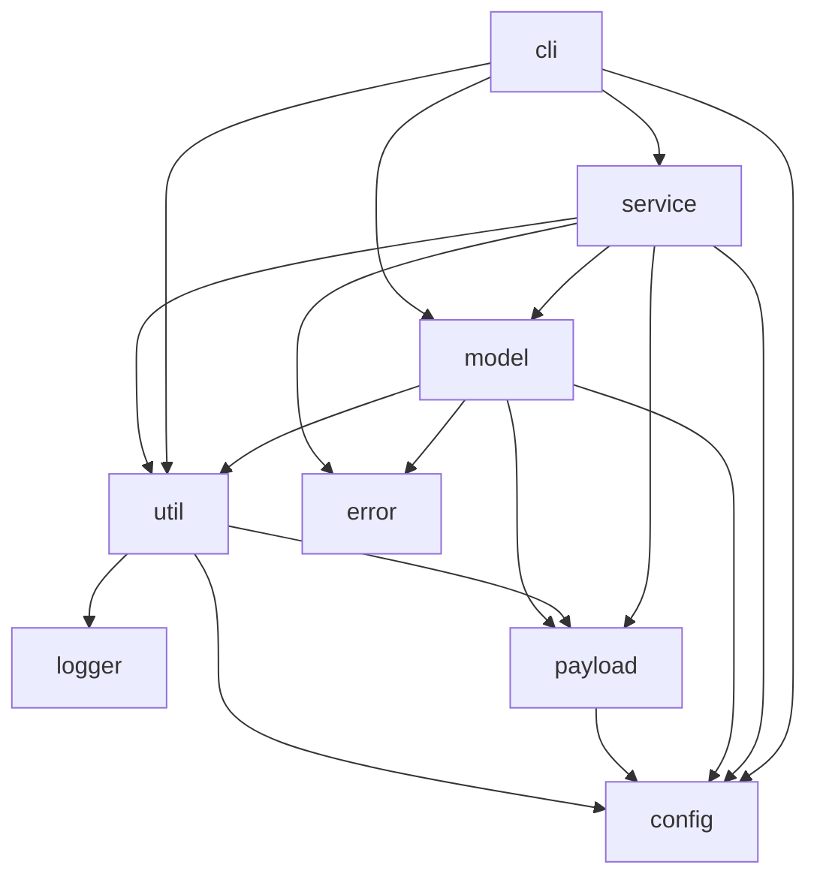

# kp

a kubernetes proxmox cli

# Prepare the network for vm

ssh into the proxmox host

`vim /etc/network/interfaces`

Add these line to add a new NAT network with cidr `192.168.56.1/24`

```bash
auto vmbr56
iface vmbr56 inet static
        address 192.168.56.1/24
        bridge-ports none
        bridge-stp off
        bridge-fd 0
        post-up   iptables -t nat -A POSTROUTING -s '192.168.56.0/24' -o vmbr0 -j MASQUERADE
        post-down iptables -t nat -D POSTROUTING -s '192.168.56.0/24' -o vmbr0 -j MASQUERADE
```

# Prefare vm template

Installing `qemu-guest-agent` is required

See [gitlab.com/tuana9a/cloud-img](https://gitlab.com/tuana9a/cloud-img)

# Prepare the config.json

See [./examples/config.json](./examples/config.json)

# Code structure



# How to use

TODO
```bash
python3 -m venv .venv
```

```bash
source .venv/bin/activate
```

```bash
pip install -e .
```

```bash
sudo ln -sf $(which kp) /usr/local/bin/kp
```

# Decision / Choise / Explain

immutable infrastructure

converting worker to control plane or in reverse is not straight forward, as `kubeadm reset` leave cni (network), iptables behind so instead of modifing the node just remove it and create a new one.

# Other

format code

```bash
find -type f -name '*.py' ! -path 'app/*' -path 'cli/*' -path 'tests/*' -exec autopep8 --in-place --aggressive --aggressive '{}' \;
```
