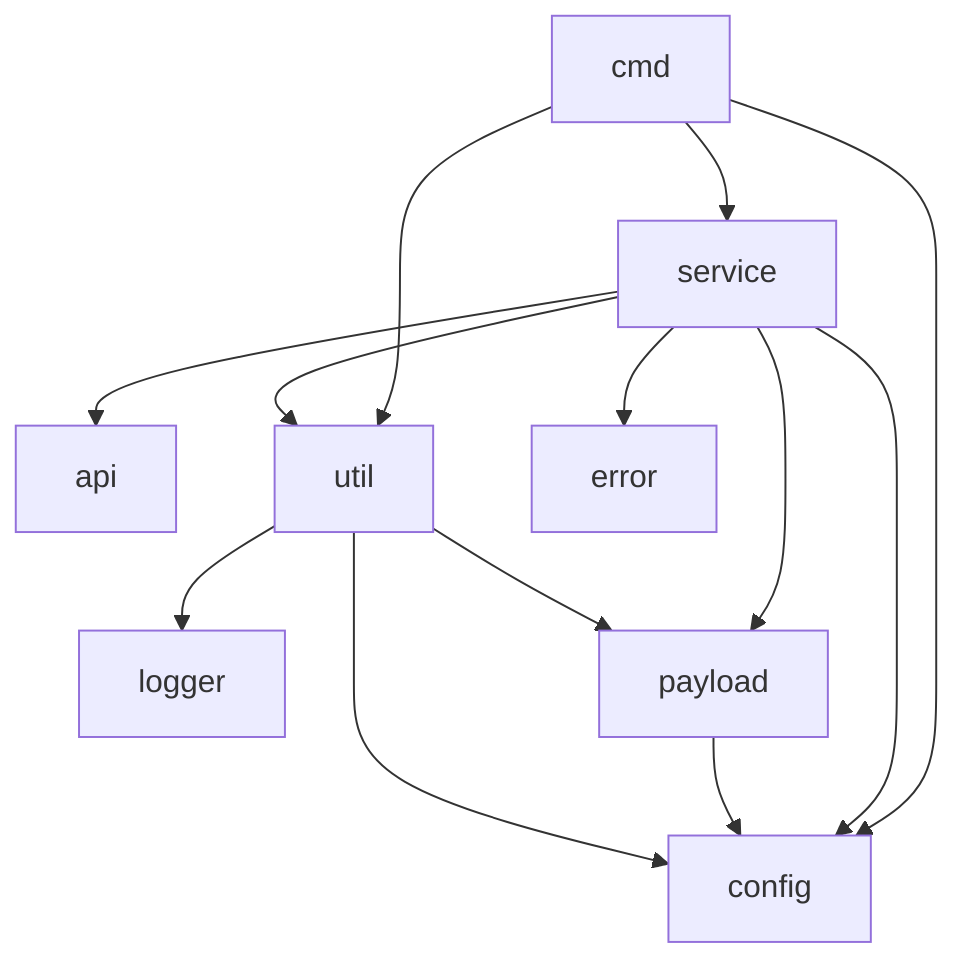

# kp

a kubernetes proxmox cli

# Prepare the network for vm

ssh into the proxmox host

`vim /etc/network/interfaces`

Add these line to add a new NAT network with cidr `192.168.56.1/24`

```bash
auto vmbr56
iface vmbr56 inet static
        address 192.168.56.1/24
        bridge-ports none
        bridge-stp off
        bridge-fd 0
        post-up   iptables -t nat -A POSTROUTING -s '192.168.56.0/24' -o vmbr0 -j MASQUERADE
        post-down iptables -t nat -D POSTROUTING -s '192.168.56.0/24' -o vmbr0 -j MASQUERADE
```

# Prefare vm template

Install tools to build image

```bash
apt install libguestfs-tools
```

Download base image

```bash
base_img_file=jammy-server-cloudimg-amd64.img
wget https://cloud-images.ubuntu.com/jammy/current/jammy-server-cloudimg-amd64.img -O $base_img_file
```

Installing `qemu-guest-agent` is required

```bash
base_img_file=jammy-server-cloudimg-amd64.img
img_file=jammy.img
cp $base_img_file $img_file
virt-customize -a $img_file --install qemu-guest-agent
```

```bash
img_file=jammy.img
storage=local-lvm
vmid=9999
core_count=1
mem_size=1024

qm create $vmid --cores $core_count --memory $mem_size --scsihw virtio-scsi-pci
qm set $vmid --name jammy
qm set $vmid --scsi0 $storage:0,import-from=$PWD/$img_file
qm set $vmid --ide2 $storage:cloudinit
qm set $vmid --boot order=scsi0
qm set $vmid --serial0 socket --vga serial0
qm template $vmid
```

# Prepare the config.json

See [./app/payload.py#Cfg](./app/payload.py#Cfg)

# Code structure



# [WIP] How to use

```bash
python3 -m venv .venv
source .venv/bin/activate
pip install -r requirements.txt
```

build it

```bash
pyinstaller --name kp --onefile --hidden-import proxmoxer.backends --hidden-import proxmoxer.backends.https main.py
```

```bash
sudo ln -sf $PWD/dist/kp /usr/local/bin/kp
```

```bash
sudo chmod +x /usr/local/bin/kp
```

# Decision / Choise / Explain

## Immutable infrastructure

- converting worker to control plane or in reverse is not straight forward, as `kubeadm reset` leave cni (network), iptables behind so instead of modifing the node just remove it and create a new one.
- when upgrading the k8s, upgrade in-place for worker node is not a must, we can just drain it, remove it, destroy it then create a new one with installed newer k8s verion.
